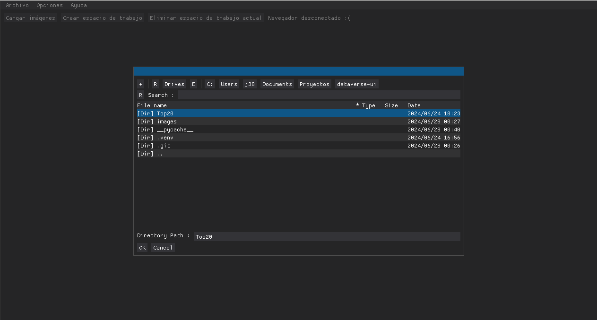
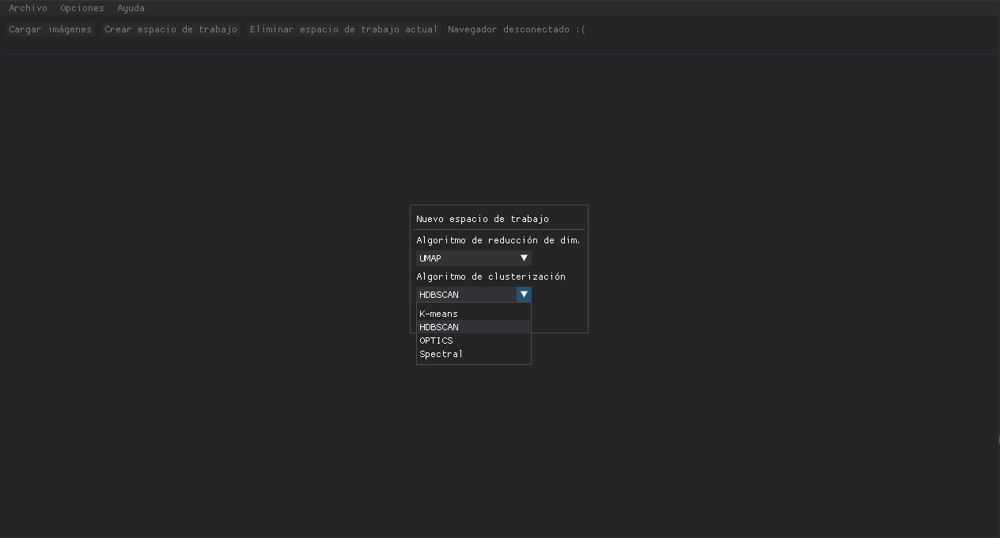
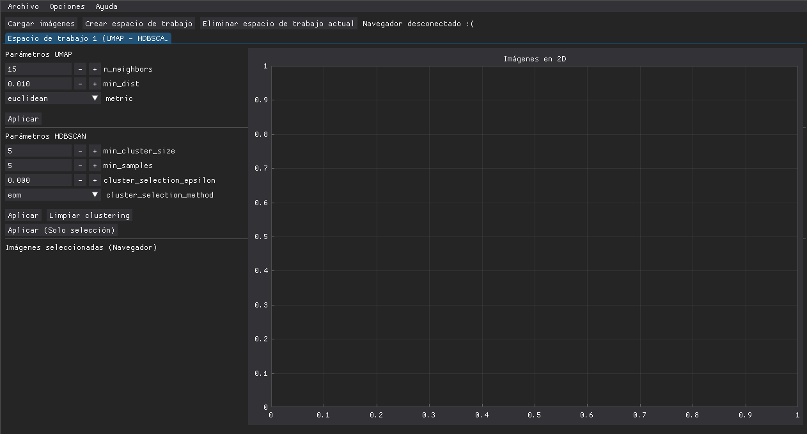
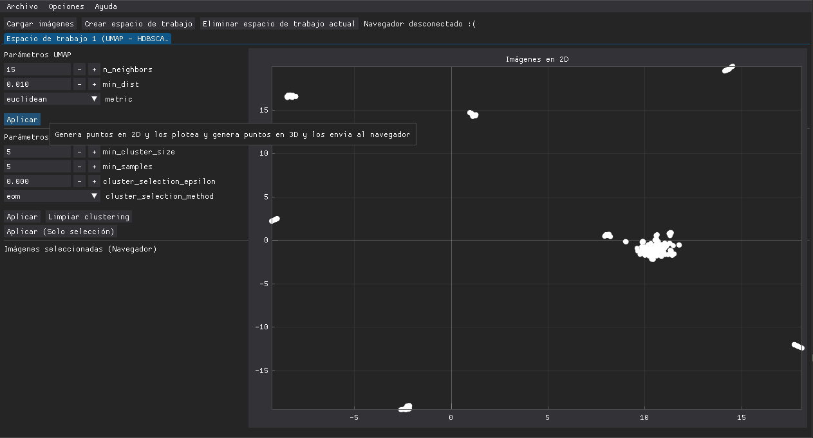
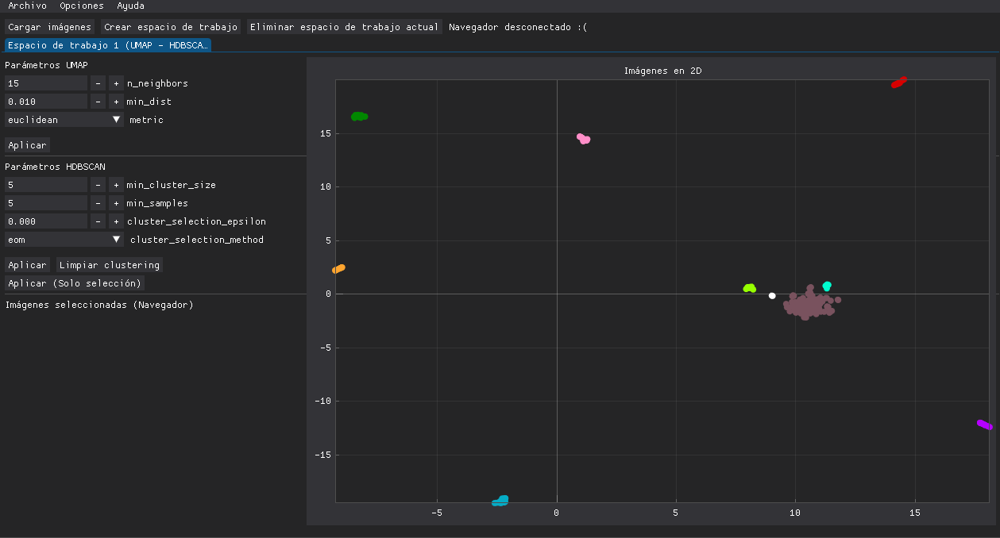
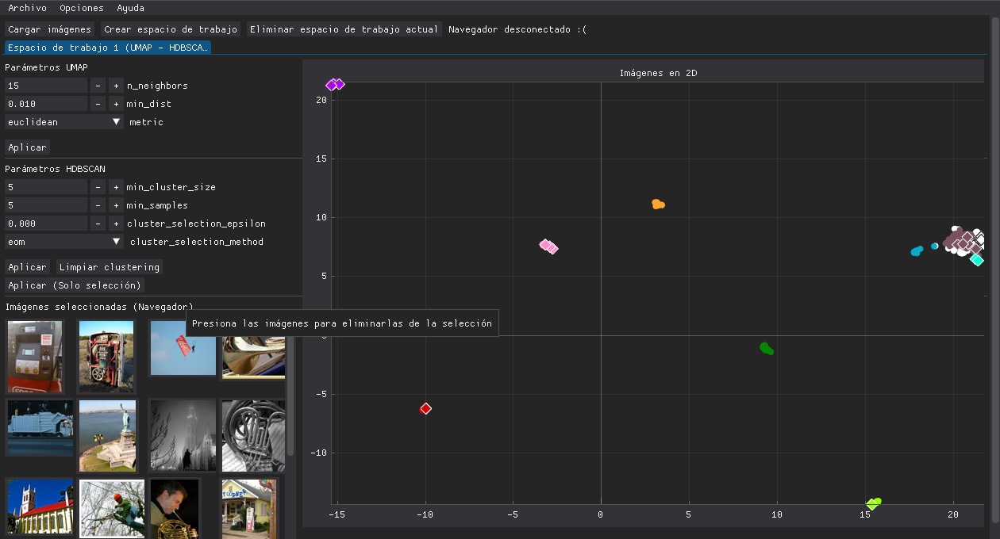

# Dataverse Controller

Aplicación para visualizar conjuntos de imágenes que maneja las diferentes técnicas de reducción de dimensionalidad y clusterización para ser comparadas lado a lado
Para usarse primero instale las librerias en `requirementes.txt` y ejecute `python main.py`. Puede usarse de manera individual o conectarse a un visualizador
VR que se encuentra en <https://github.com/Nyanzey/Dataverse>.

## Librerias usadas

- umap-learn
- scikit-learn
- numpy
- dearpygui
- onnx-runtime (con el modelo efficientnet-lite4-11.onnx)

## Características

### Selección de carpeta de imágenes

### Múltiples algoritmos para seleccionar

### Parámetros interactivos para cada técnica

### Generación de puntos 2D

### Coloreo de clusters

### Visualización de selección de puntos

### Todo esto con guias para evitar perderse en el programa

## Créditos

- Bruno Fernandez
- Fredy Quispe
- Joaquin Pino